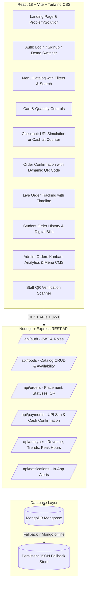

# Implementation Plan: Smart Canteen Pre-Ordering System

A modern, responsive, full-stack college canteen pre-ordering software prototype built to eliminate peak-hour canteen queues through advance ordering, instant digital/cash payments, dynamic QR code generation, real-time order tracking, staff QR verification, and comprehensive canteen operations management.

**Tagline**: *“Because Good Food Shouldn’t Keep You Waiting!”*

---

## User Review Required

> [!IMPORTANT]
> **Database Architecture (MongoDB with Auto-Fallback)**:
> Since local MongoDB service may or may not be active on the host machine, the backend will feature a hybrid persistence layer:
> - Attempts connection to MongoDB (`mongodb://localhost:27017/smart_canteen` or `MONGODB_URI` environment variable).
> - If MongoDB is not running, it automatically activates a persistent file-backed JSON store with identical schemas and query capabilities. This guarantees the prototype runs out-of-the-box on any machine without setup failure, while fully adhering to MongoDB Mongoose schemas.
>
> **Simulated UPI Payments**:
> As specified in the requirements, GPay / UPI payments are simulated with high fidelity (progress spinner, transaction ID generation like `TXN20260922001`, simulated success/failure toggle) without touching live banking APIs.

---

## Architecture Overview



---

## Key Features & User Flow

1. **Authentication & Roles**:
   - Student and Admin login/registration with bcrypt password hashing and JWT token issuance.
   - One-click demo credentials picker:
     - **Student**: `student@college.edu` / `student123`
     - **Admin**: `admin@college.edu` / `admin123`
     - 4 additional pre-seeded student accounts (Priya, Rahul, Ananya, Arjun).
2. **Food Menu Catalog**:
   - 10+ standard & realistic canteen items with Unsplash food imagery:
     - Idli Sambar (₹30), Veg Noodles (₹70), Veg Sandwich (₹40), Veg Fried Rice (₹80), Dosa (₹40), Lemon Rice (₹50), Samosa (₹20), Masala Tea (₹15), Filter Coffee (₹20), Fresh Juice (₹40), Paneer Roll (₹60), Chole Bhature (₹75).
   - Category filtering (Breakfast, Meals, Snacks, Beverages), price sorting, search bar, and live availability toggles.
3. **Cart & Checkout**:
   - Quantity increment/decrement, item removal, price calculation, student discount/tax breakdown.
   - Student details verification (Name, College ID, Phone).
   - Payment selection: **GPay / UPI** (Simulated screen with TXN ID) or **Cash at Counter** (Payment Pending flag).
4. **Order Confirmation & QR Generation**:
   - Unique Order ID (`ORD-YYYYMMDD-XXX`), verification payload.
   - Dynamic QR Code rendered via `qrcode` with download & print digital bill options.
5. **Real-Time Order Tracking**:
   - Visual step timeline: `Order Placed` → `Payment Confirmed` → `Preparing` → `Ready for Pickup` → `Collected`.
   - Estimated preparation time countdown (e.g. 10 mins).
   - "Simulate Next Step" button for instant interactive demonstrations.
6. **Admin & Staff Portal**:
   - KPI metrics: Today's Orders, Pending, Preparing, Ready, Completed, Total Revenue.
   - Order management: Accept, Start Preparing, Mark Ready, Mark Collected, Mark Cash as Paid.
   - Menu CMS: Add new food item, edit details, delete, toggle availability status.
   - Built-in QR Scanner: Camera/webcam scanning or manual Order ID search with instant status verification and "Mark as Collected" action.
   - Sales Analytics: Orders per day, Revenue per day, Most popular items, Peak ordering time breakdown.
7. **Notification System**:
   - In-app notification drawer showing real-time updates when an order status changes.

---

## Proposed Project Structure

```
d:/project/
├── package.json               # Root scripts (concurrently run client & server)
├── server/
│   ├── package.json
│   ├── server.js              # Express app entry & DB connection
│   ├── config/
│   │   └── db.js              # MongoDB connection with JSON fallback logic
│   ├── models/
│   │   ├── User.js
│   │   ├── FoodItem.js
│   │   ├── Order.js
│   │   ├── Payment.js
│   │   └── Notification.js
│   ├── controllers/
│   │   ├── authController.js
│   │   ├── foodController.js
│   │   ├── orderController.js
│   │   ├── paymentController.js
│   │   └── analyticsController.js
│   ├── middleware/
│   │   └── authMiddleware.js  # JWT verification & role checking
│   ├── data/
│   │   └── seedData.js        # Realistic preloaded students, food, and orders
│   └── routes/
│       ├── authRoutes.js
│       ├── foodRoutes.js
│       ├── orderRoutes.js
│       ├── paymentRoutes.js
│       └── analyticsRoutes.js
└── client/
    ├── package.json
    ├── vite.config.js
    ├── tailwind.config.js
    ├── index.html
    └── src/
        ├── App.jsx
        ├── main.jsx
        ├── index.css
        ├── context/
        │   ├── AuthContext.jsx
        │   └── CartContext.jsx
        ├── components/
        │   ├── Navbar.jsx
        │   ├── Footer.jsx
        │   ├── FoodCard.jsx
        │   ├── StatusBadge.jsx
        │   ├── NotificationDropdown.jsx
        │   └── QRModal.jsx
        └── pages/
            ├── HomePage.jsx          # Hero, 4-step flow, Problem/Solution
            ├── LoginPage.jsx         # Login, signup, demo buttons
            ├── DashboardPage.jsx     # Quick orders, popular items, current status
            ├── MenuPage.jsx          # Filterable, searchable food catalog
            ├── CartPage.jsx          # Cart review
            ├── CheckoutPage.jsx      # Payment selection & student details
            ├── PaymentSimPage.jsx    # Simulated UPI/GPay flow
            ├── ConfirmationPage.jsx  # Order confirmed, QR code, Bill download
            ├── TrackingPage.jsx      # Real-time status tracker with timeline
            ├── MyOrdersPage.jsx      # Order history & receipt view
            ├── AdminDashboardPage.jsx# Orders Kanban/list, status updates
            ├── MenuManagementPage.jsx# Admin Food CRUD
            ├── QRScannerPage.jsx     # Staff verification scanner
            └── AnalyticsPage.jsx     # Visual charts & sales breakdown
```

---

## Verification Plan

### Automated & Sanity Tests
1. **Server API Verification**:
   - `POST /api/auth/login`: Verify student & admin authentication tokens.
   - `GET /api/foods`: Verify 10+ items loaded with categories and prices.
   - `POST /api/orders`: Place sample order and verify QR payload generation.
   - `PATCH /api/orders/:id/status`: Update status through lifecycle (`Preparing` -> `Ready` -> `Collected`).
   - `GET /api/analytics`: Verify calculated revenue, daily orders, and popular items.
2. **Frontend Build Verification**:
   - Run `npm run build` in `client/` to verify zero TypeScript/JSX syntax errors.

### Manual End-to-End User Flow
1. Open web application at `http://localhost:5173`.
2. View Home page with 4-step flow and Problem/Solution section.
3. Click "Demo Student Login" to log in as `student@college.edu`.
4. Browse Menu, filter by "Breakfast", add "Idli Sambar" (qty: 2) and "Filter Coffee" (qty: 1) to cart.
5. Open Cart, verify total (₹30*2 + ₹20 = ₹80), proceed to Checkout.
6. Test both payment routes:
   - **Path A (UPI/GPay)**: Open simulated UPI payment, click "Pay Now", observe processing spinner, receive `TXN...` ID, get QR Code.
   - **Path B (Cash at Counter)**: Order created with status "Payment Pending", get QR Code.
7. Track Order: Observe progress steps and estimated prep time.
8. Switch to Admin via Demo credentials (`admin@college.edu`).
9. View incoming order in Admin Dashboard.
10. Open QR Verification Scanner: Test verifying order ID and marking it "COLLECTED" (and "PAID" if cash).
11. Visit Menu Management: Toggle "Veg Noodles" to Unavailable, verify student menu reflects it instantly.
12. Visit Sales Analytics: View revenue charts, order counts, and top-selling items.
